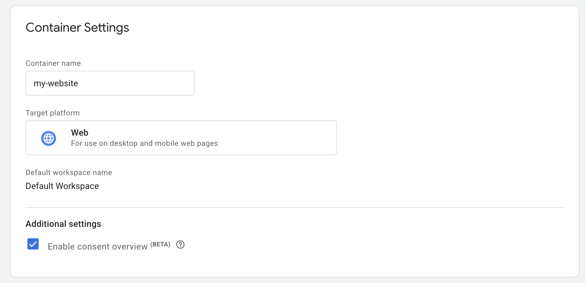

We're working on a beta version of the Google Tag Manager integration.
c15t will automatically inject the GTM script into your page.

<Steps> 
<Step>
### Creating a Tag Manager Container

<Callout type="note">
This step is optional if you already have a Tag Manager container. Ensure your container has consent overview enabled.
</Callout>

After signing into Google Tag Manager, you can create a new container.
[Continue to Google Tag Manager](https://tagmanager.google.com/)

1. In Tag Manager, click Admin > Container Settings.
2. Under Additional Settings, select "Enable consent overview".


</Step>

<Step>
### Setting up c15t with Google Tag Manager

After creating your container, you can set up c15t with Google Tag Manager.

All you need to do copy and paste your container ID into the `unstable_googleTagManager.id` property.

This begins with "GTM-". 

```tsx
<ConsentManagerProvider
  options={{
    mode: 'c15t',
    backendURL: 'https://your-instance.c15t.dev',
    unstable_googleTagManager: {
      id: 'GTM-XXXXXXX',
    },
  }}
>
```

If you have GTM in your site already, you can remove the GTM script from your head section.

</Step>
</Steps>

### All Done!

c15t will automatically inject the GTM script into your page and update the consent state in GTM.


